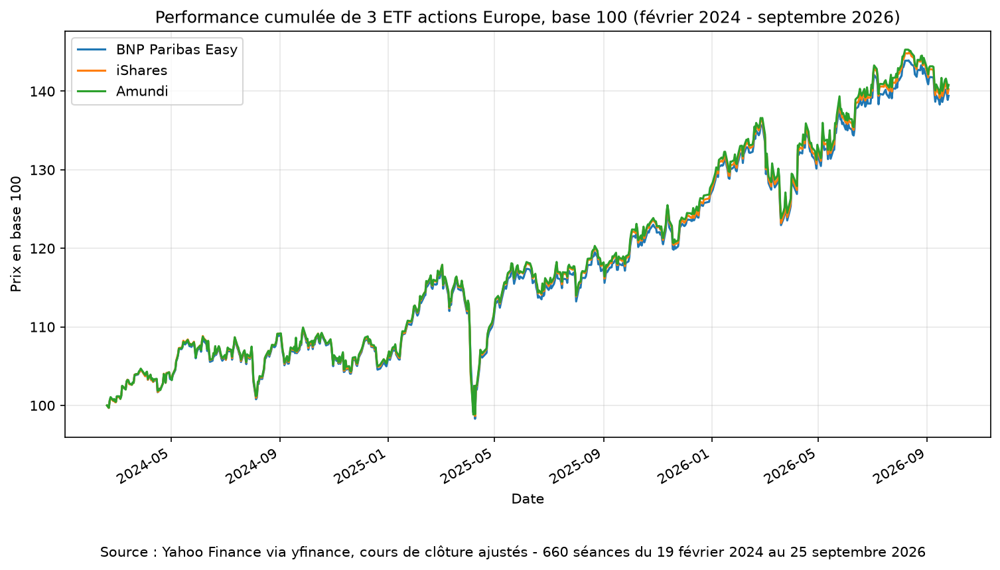

# Python finance basics

Traitement de données de marché en Python. Exercices réalisés en septembre 2026
dans le cadre d'une préparation à l'alternance en gestion d'actifs.

## Notebooks

| Fichier | Contenu |
|---|---|
| `01_rendements_journaliers.ipynb` | Rendement quotidien d'un titre, meilleure et pire séance |
| `02_rendements_par_titre.ipynb` | Rendements par titre sur un fichier multi-valeurs, tickers découverts à la lecture |
| `03_lecture_csv_bourse.ipynb` | Lecture d'un historique CSV réel, gestion des données manquantes |
| `04_comparaison_etf_europe.ipynb` | Trois ETF STOXX Europe 600 comparés en base 100 — l'écart de performance confronté à l'écart de frais |
| `05_indicateurs_risque.ipynb` | Volatilité et rendement annualisés, distribution des rendements, maximum drawdown des 3 ETF |

Les notebooks 01 à 03 n'utilisent que la bibliothèque standard. Le notebook 04 introduit pandas et yfinance, le notebook 05 matplotlib.

## Données

`data/aapl_us_d.csv` — historique quotidien Apple depuis 1984 (source : stooq.com).
`data/prix.txt` et `data/cotations.txt` — fichiers d'exercice, format `date;prix` et `ticker;date;prix`.
`data/etf_europe.csv` — cours de clôture ajustés de MEUD.PA, ETZ.PA et EXSA.DE,
téléchargés via yfinance le 25 septembre 2026.

## Notions travaillées

Lecture de fichiers, dictionnaires, listes, module `csv`, gestion d'erreurs,
calcul de rendements simples et composés.

Avec pandas : `read_csv` et index temporel, `dropna`, `pct_change`, `groupby`,
mise en base 100, graphique de performance cumulée.

## Environnement

Python 3. Les notebooks 01 à 03 s'exécutent sans installation. Le notebook 04
requiert `pandas`, `yfinance` et `matplotlib`.

Tous utilisent des chemins relatifs et s'exécutent tels quels après clonage du dépôt.
